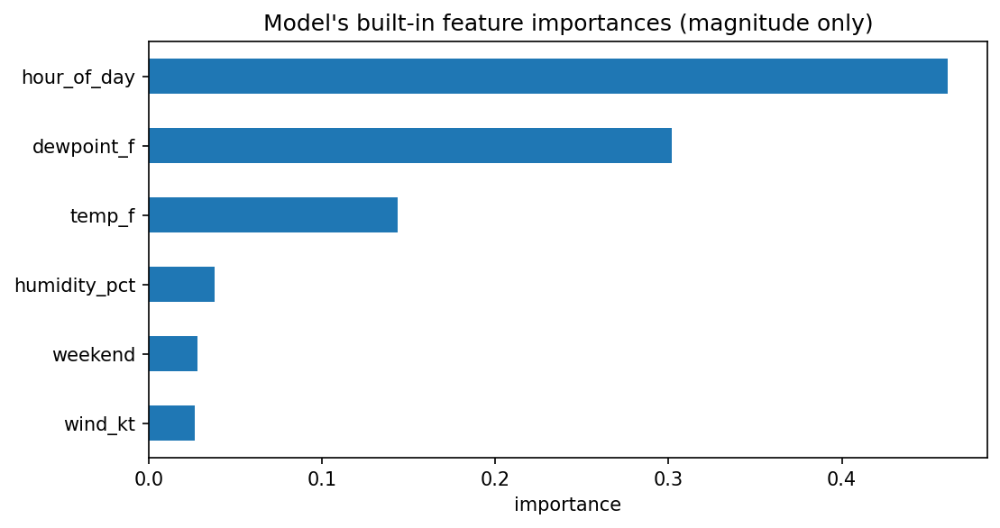
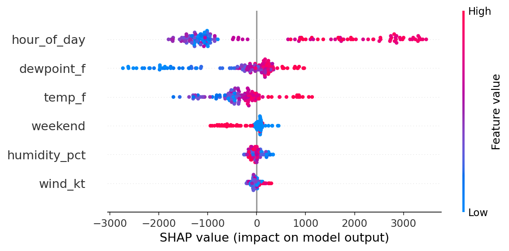
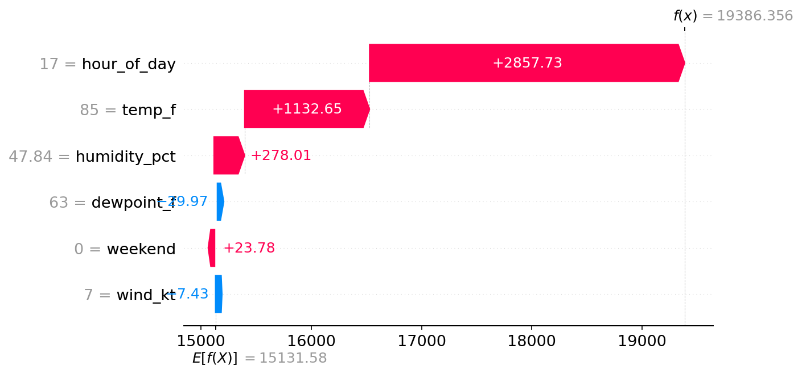

# Lab 2 report - explaining our demand model

**Authors:** Trishan Kundu

## Global - what the model leans on overall (Partner A)

The model leans most heavily on hour of day, followed by dew point and air temperature.

Hour of day is also the #1 feature in the SHAP explanation, and higher hour-of-day values generally push predicted electricity demand upward.

## Local - one hour explained (Partner B)

The predictions generally track the actual-demand diagonal well, with a test-set R² of 0.83 and a typical prediction error of about 662 MW.

For the peak test hour at 17:00 on August 18, 2026, hour of day and the 85°F temperature pushed the prediction strongly upward, while dew point and wind speed pulled it slightly downward; the actual demand for that hour was 18,585 MW.

## What this explanation can't tell us

SHAP explains how this model used the available features to make its predictions, but it does not prove that those features physically caused changes in electricity demand.